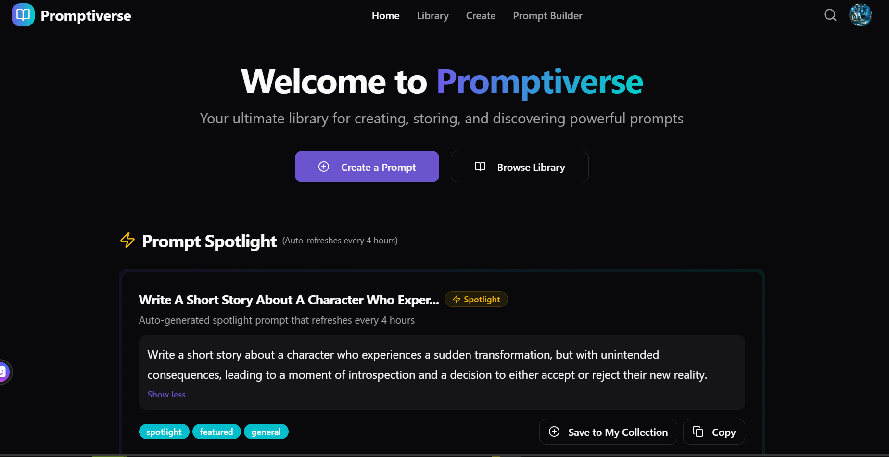
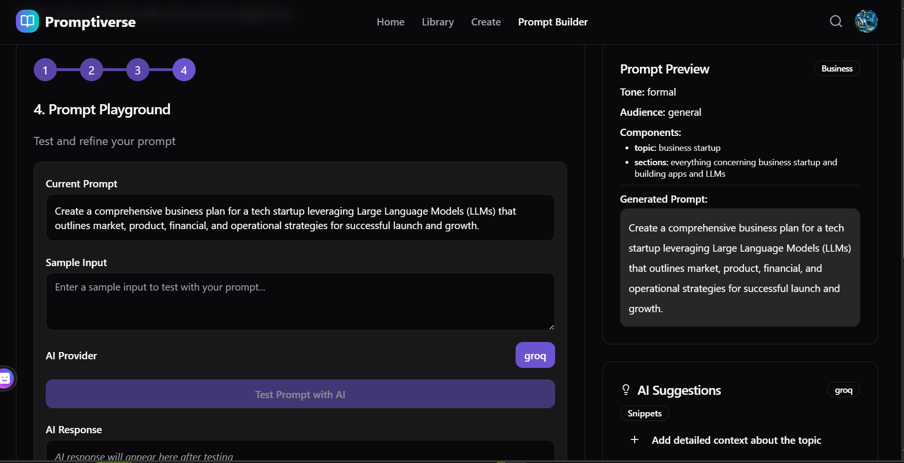
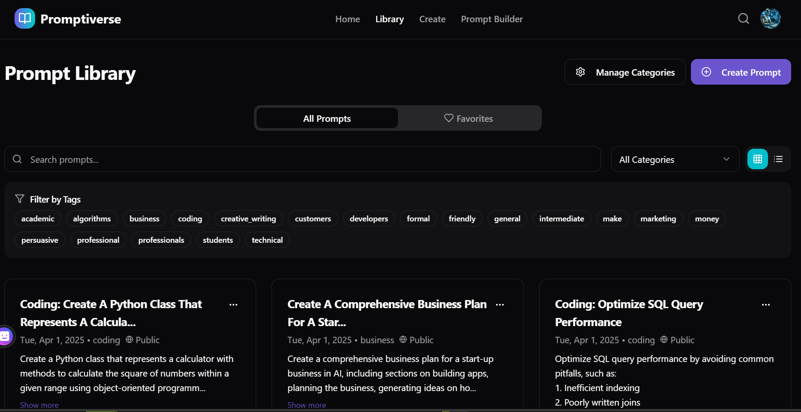
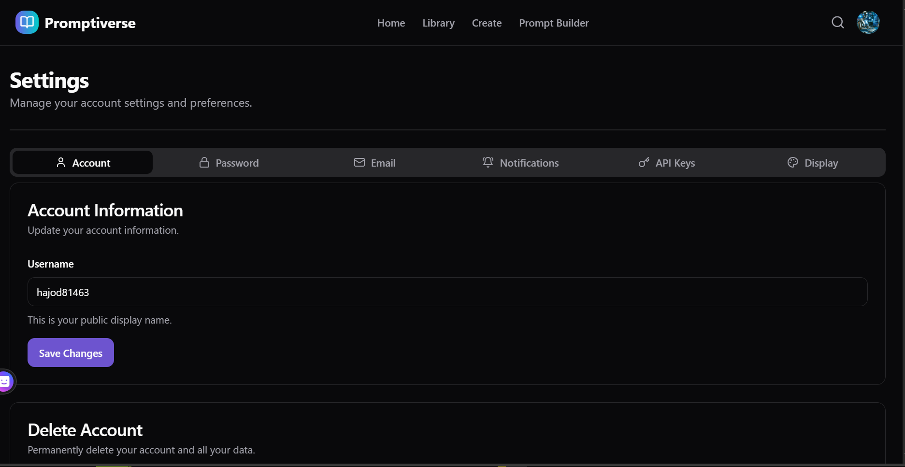
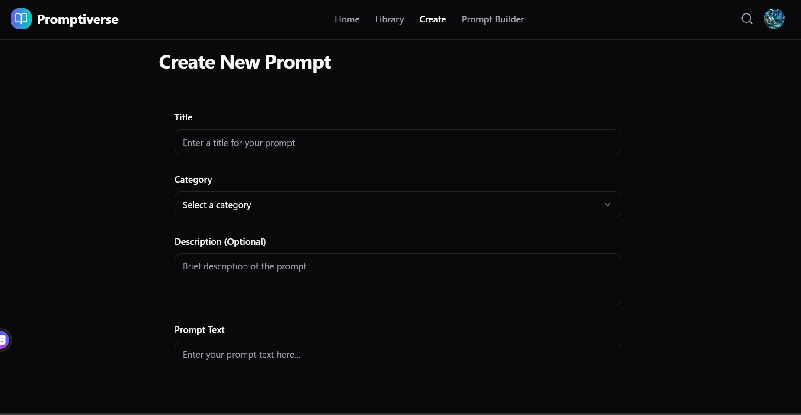

# Promptiverse

<div align="center">
  <p><strong>Create, manage, and share effective AI prompts</strong></p>
</div>

## 📋 Overview

Promptiverse is a comprehensive web application designed for creating, managing, sharing, and utilizing AI prompts effectively. It provides a user-friendly interface to build complex prompts, organize them in a personal library, discover prompts shared by others, and interact with various AI models including OpenAI, Google Gemini, and Groq.



## ✨ Key Features

### 🔨 Prompt Builder

- **Interactive Step-by-Step Interface**: Build prompts through a guided process
- **AI-Powered Suggestions**: Get dynamic, tailored suggestions at each step
- **Multi-Model Support**: Generate prompts using OpenAI, Gemini, or Groq
- **Live Preview**: See your prompt take shape in real-time
- **Auto-Save**: Resume your work with automatic progress saving



### 📚 Prompt Library

- **Personal Collection**: Organize and manage your prompts
- **Favorites**: Mark prompts as favorites for quick access
- **Categories & Tags**: Organize prompts with custom categories and tags
- **Grid/List Views**: Toggle between different viewing modes
- **Search & Filter**: Find prompts by text, category, or tags



### 🔍 Spotlight & Discovery

- **Spotlight Prompts**: Discover auto-generated featured prompts
- **Public Prompts**: Browse prompts shared by the community
- **Add to Collection**: Save public prompts to your library

### ⚙️ API Integration

- **Multiple AI Providers**: Connect with OpenAI, Google Gemini, and Groq
- **Secure Key Management**: Safely store and manage your API keys
- **Dynamic Provider Selection**: Automatically use available providers

### 👤 User Management

- **Secure Authentication**: User accounts powered by Supabase
- **User Profiles**: Customize your profile information
- **Privacy Controls**: Choose which prompts to make public or private
- **Password Management**: Secure password reset flow with email notifications

## 🛠️ Technology Stack

### Frontend

- **Framework**: React with TypeScript
- **Build Tool**: Vite
- **Styling**: Tailwind CSS
- **UI Components**: shadcn/ui
- **Routing**: React Router
- **State Management**: TanStack Query (React Query)
- **Form Handling**: React Hook Form with Zod validation

### Backend & Database

- **Backend**: Supabase (PostgreSQL)
- **Authentication**: Supabase Auth
- **Storage**: Supabase Storage

### AI Integrations

- **OpenAI**: Using the official SDK (`openai`)
- **Google Gemini**: Using the official SDK (`@google/generative-ai`)
- **Groq**: Using the official SDK (`groq-sdk`)

## 🗂️ Project Structure

```bash
promptly-innovate/
├── public/             # Static assets
├── src/                # Source code
│   ├── components/     # Reusable UI components
│   │   ├── ui/         # shadcn/ui components
│   │   └── ...         # Custom components
│   ├── contexts/       # React context providers
│   ├── hooks/          # Custom React hooks
│   ├── integrations/   # External service integrations
│   │   └── supabase/   # Supabase client and types
│   ├── lib/            # Utility functions and types
│   │   ├── schemas/    # Zod validation schemas
│   │   └── utils/      # Helper utilities
│   ├── pages/          # Page components
│   ├── services/       # Service layer
│   │   └── ai/         # AI service implementations
│   ├── App.tsx         # Main application component
│   └── main.tsx        # Application entry point
├── supabase/           # Supabase configuration
│   └── migrations/     # Database migration scripts
├── .env.example        # Example environment variables
└── ...                 # Configuration files
```

## 🚀 Getting Started

### Prerequisites

- Node.js (v18 or later recommended)
- npm, yarn, or bun
- Git
- Supabase account
- API keys for desired AI services (OpenAI, Google Gemini, Groq)

### Installation

1. **Clone the repository:**

   ```bash
   git clone https://github.com/KPrince-coder/promptiverse.git
   cd promptiverse
   ```

2. **Install dependencies:**

   ```bash
   npm install
   # or
   yarn install
   # or
   bun install
   ```

3. **Set up environment variables:**

   ```bash
   cp .env.example .env
   ```

   Edit the `.env` file and add your Supabase URL and anon key:

   ```env
   VITE_SUPABASE_URL=your_supabase_project_url
   VITE_SUPABASE_ANON_KEY=your_supabase_anon_key
   ```

4. **Set up Supabase:**
   - Create a new Supabase project
   - Run the migration script in `supabase/migrations/user_profiles_and_prompts_management.sql` using the Supabase SQL Editor

5. **Start the development server:**

   ```bash
   npm run dev
   # or
   yarn dev
   # or
   bun dev
   ```

6. **Open your browser** and navigate to `http://localhost:8080`

## 📝 Usage Guide

### Account Management

#### Password Reset

1. On the login page, click "Forgot password?"
2. Enter your email address and click "Send Reset Link"
3. Check your email for the password reset link
4. Click the reset link or copy the reset token
5. Enter and confirm your new password
6. After successful reset, you'll be redirected to the login page
7. Sign in with your new password

### Setting Up API Keys

1. Navigate to the Settings page
2. Click on "API Keys" tab
3. Add your API keys for the AI providers you want to use:
   - OpenAI: Get your API key from [OpenAI Platform](https://platform.openai.com/)
   - Google Gemini: Get your API key from [Google AI Studio](https://makersuite.google.com/)
   - Groq: Get your API key from [Groq Cloud](https://console.groq.com/)



### Creating a Prompt

#### Using the Prompt Builder

1. Navigate to the Prompt Builder page
2. Follow the step-by-step process:
   - Select a category
   - Choose a tone
   - Define your audience
   - Add specific components
3. Review the generated prompt in the preview panel
4. Click on AI suggestions to incorporate them into your prompt
5. Click "Save as Prompt" when finished
6. Add a title, choose visibility (public/private), and save

#### Creating a Prompt Manually

1. Navigate to the Library page
2. Click "Create Prompt"
3. Fill in the form with your prompt details
4. Click "Save" to add it to your library



### Managing Your Prompts

1. Navigate to the Library page
2. View your prompts in grid or list view
3. Use the search bar and filters to find specific prompts
4. Click on a prompt to view its details
5. Use the edit or delete buttons to manage your prompts
6. Click the heart icon to add/remove from favorites

## 🧩 Core Components

### Prompt Builder

The Prompt Builder provides a guided, step-by-step interface for creating effective prompts with AI assistance. It features:

- Multi-step form with category, tone, audience, and component selection
- AI-powered suggestions that update based on your inputs
- Live preview of the generated prompt
- Support for multiple AI providers (OpenAI, Gemini, Groq)
- Auto-save functionality to resume your work

### Prompt Library

The Prompt Library allows you to manage your collection of prompts with features like:

- Grid and list views for different browsing experiences
- Filtering by category, tags, and search terms
- Favorites tab for quick access to preferred prompts
- Edit and delete functionality
- Public/private visibility controls

### AI Integration

The application integrates with multiple AI providers through a unified interface:

- Provider-agnostic API for generating prompts and suggestions
- Automatic fallback between providers based on available API keys
- Optimized prompting techniques for each provider
- Support for shot prompting when appropriate

## 🔧 Available Scripts

- `npm run dev` - Start the development server
- `npm run build` - Build for production
- `npm run build:dev` - Build for development
- `npm run lint` - Run ESLint
- `npm run preview` - Preview the production build locally

## 🚀 Deploying Edge Functions

To deploy the Supabase Edge Functions (required for password reset notifications):

1. Make sure you have Node.js installed (v16 or later recommended).

2. Log in to Supabase:
   ```bash
   npx supabase login
   ```

3. Run the deployment script with your Supabase project reference ID as an argument:
   ```bash
   # Windows
   deploy-functions.bat YOUR_PROJECT_REF

   # Mac/Linux
   chmod +x deploy-functions.sh
   ./deploy-functions.sh YOUR_PROJECT_REF
   ```

   Replace `YOUR_PROJECT_REF` with your actual Supabase project reference ID (found in Project Settings).

For more details, see the [Edge Functions README](supabase/functions/README.md).

## 🤝 Contributing

Contributions are welcome! Please feel free to submit a Pull Request.

1. Fork the repository
2. Create your feature branch (`git checkout -b feature/amazing-feature`)
3. Commit your changes (`git commit -m 'Add some amazing feature'`)
4. Push to the branch (`git push origin feature/amazing-feature`)
5. Open a Pull Request

## 📄 License

This project is licensed under the MIT License - see the LICENSE file for details.

## 📞 Contact

If you have any questions or feedback, please reach out to us at [your-email@example.com](mailto:your-email@example.com).

---

<div align="center">
  <p>Built with ❤️ by the Promptiverse Team</p>
</div>
